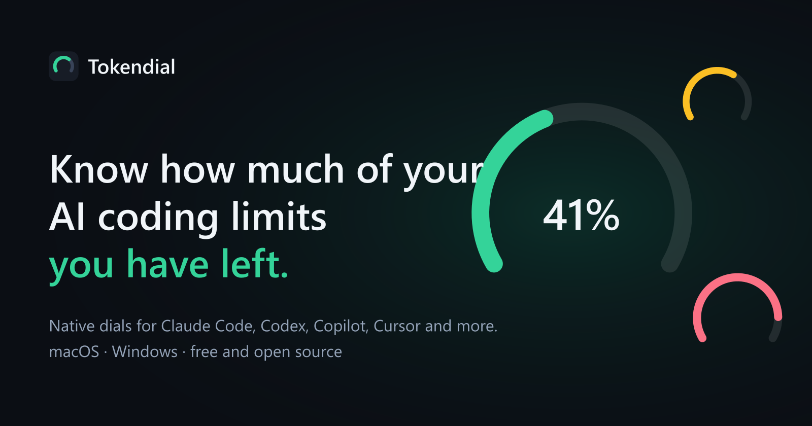
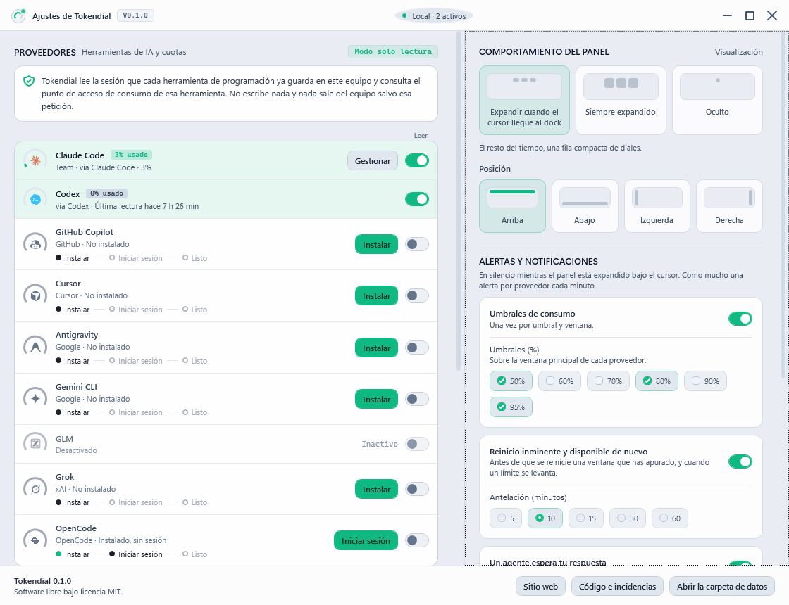

<div align="center">



# Tokendial

**Know how much of your AI coding limits you have left.**
Native usage dials for Claude Code, Codex, Copilot, Cursor and five more, on the edge of your screen.

[](https://github.com/r4yb3l/tokendial/releases/latest)
[](https://github.com/r4yb3l/tokendial/actions/workflows/ci.yml)
[](LICENSE)


[**Download**](https://github.com/r4yb3l/tokendial/releases/latest) · [Website](https://tokendial.vercel.app) · [Guides](https://tokendial.vercel.app/guides) · [Security](SECURITY.md)

</div>

---

You build with several assistants at once, and the only way to find out you are out of quota is when one
of them stops answering. Every vendor meters differently and none of them warns you first.

Tokendial puts a dial per tool on the edge of your screen. It reads the session each tool already keeps on
your machine, asks that tool's own usage endpoint, and tells you before a window runs out — not after.

- **A dock, not a window.** A compact row of dials at the edge you choose, which opens when the cursor
  reaches it and never takes focus from what you are typing in.
- **Read-only by design.** Credentials are read where their tool already stores them, never written, never
  refreshed, never sent anywhere but that tool's own endpoint.
- **Two native apps.** Swift and AppKit on macOS, C# and WPF on Windows, built from one shared
  specification in [`docs/`](docs/) so a provider added once appears on both.
- **Free and open source.** No account, no telemetry, no crash reports.

## What it looks like



The settings window: a dial per provider coloured through its usage bands, the install assistant for the
tools you do not have yet, and the dock's position and behaviour as pictures rather than radio buttons.
Shown here in Spanish, one of the six languages it speaks.

## Install

Download the [latest release](https://github.com/r4yb3l/tokendial/releases/latest):

| Platform | File | Requirement |
|---|---|---|
| Windows | `Tokendial-win-Setup.exe`, or the portable zip. `Tokendial-win.msi` installs for every account and needs an administrator, for machines managed by policy | Windows 10 1809 or later |
| macOS | `Tokendial-<version>-macos.dmg`, or the zip | macOS 14 or later, Intel and Apple Silicon in one universal binary |

**Neither build is signed with a paid certificate, and both systems will say so.** Windows shows
"Windows protected your PC": choose More info, then Run anyway. macOS refuses a notarised-less app that
arrives with a quarantine flag and claims it is damaged — either right-click the app, choose Open, and
Open again under System Settings → Privacy & Security, or clear the flag yourself:

```sh
xattr -dr com.apple.quarantine /Applications/Tokendial.app
```

This will not change. A Windows code-signing certificate and an Apple Developer ID cost more every year
than this project will ever earn, which is nothing. What each release publishes instead is a SHA-256
checksum for every file a person downloads — `Tokendial-win.sha256` and `Tokendial-<version>-macos.sha256`
— so the download can be checked against what the build produced:

```sh
sha256sum -c Tokendial-win.sha256                       # Linux, macOS, Git Bash
```

```powershell
Get-FileHash Tokendial-win-Setup.exe -Algorithm SHA256  # PowerShell
```

## What it reads

Each provider is opt-in, and a tool you do not have yet shows an **Install** button that puts the vendor's
own command on screen before running it in a terminal you can watch. Nothing runs until you press Run.

| Provider | Installed with, on macOS | on Windows |
|---|---|---|
| Claude Code | `brew install --cask claude-code` | `irm https://claude.ai/install.ps1 \| iex` |
| Codex | `brew install --cask codex` | `irm https://chatgpt.com/codex/install.ps1 \| iex` |
| GitHub Copilot | `brew install --cask copilot-cli` | `winget install GitHub.Copilot` |
| Cursor | `brew install --cask cursor` | `winget install Anysphere.Cursor` |
| Antigravity | `brew install --cask antigravity` | `winget install Google.Antigravity` |
| Gemini CLI | `npm install -g @google/gemini-cli` | `npm install -g @google/gemini-cli` |
| Grok | `curl -fsSL https://x.ai/cli/install.sh \| sh` | `irm https://x.ai/cli/install.ps1 \| iex` |
| OpenCode | `brew install opencode` | `winget install SST.opencode` |
| GLM (Z.ai Coding Plan) | an API key rather than a tool | — |

## Alerts

| Alert | When |
|---|---|
| Threshold | crossing 50, 80 or 95 % of a provider's headline window, once per window |
| Reset soon | ten minutes before a window you have leaned on resets, and again when a limit lifts |
| Waiting | an agent has waited on your answer for 20 s, repeating every five minutes |
| Limit | a window hits 100 % or the provider reports a block, with the time it comes back |

Silent while the dock is open under your cursor, at most one per provider per minute, and remembered
across restarts. The engine is specified in [`docs/alerts/spec.md`](docs/alerts/spec.md), and both
platforms pass the same conformance vectors.

## Several accounts

Tokendial reads what a tool stores, so a second account is a second configuration directory. Claude Code
signed in with `CLAUDE_CONFIG_DIR=~/.claude-work`, or Codex with `CODEX_HOME=~/.codex-work`, each get their
own dial ("Claude Code (work)"), their own alerts and their own sessions. The other tools keep a single
sign-in.

## Building from source

```sh
# Windows
dotnet test windows/Tokendial.slnx
dotnet run --project windows/Tokendial.App

# macOS
swift test --package-path macos/TokendialCore
brew install xcodegen && cd macos && xcodegen generate
xcodebuild -project Tokendial.xcodeproj -scheme Tokendial -configuration Debug build

# the website
cd site && npm ci && npm run dev
```

A release is built by CI from a `v*` tag that matches [`VERSION`](VERSION): Velopack packages Windows,
`xcodebuild` archives a universal macOS binary, and both are attached to the GitHub release.

## What is where

| Path | |
|---|---|
| `docs/` | the shared specification: providers, alert vectors, i18n catalogues, design tokens |
| `windows/` | the WPF app and its core, plus the test suite |
| `macos/` | the AppKit app and `TokendialCore`, its Swift package |
| `site/` | the website and the guides (Astro, six languages) |
| `tools/` | the helper that builds and tests macOS over SSH from a Windows machine |

Both apps read `docs/` at runtime and both test suites read it too, so a provider or a string is changed
once. See [`docs/design/tokens.md`](docs/design/tokens.md) for the design system and
[`SECURITY.md`](SECURITY.md) for what leaves your machine, which is as little as we could manage.

## Licence

[MIT](LICENSE). Tokendial is not affiliated with Anthropic, OpenAI, GitHub, Google, xAI, Anysphere, Z.ai
or SST; each product name belongs to its owner.
